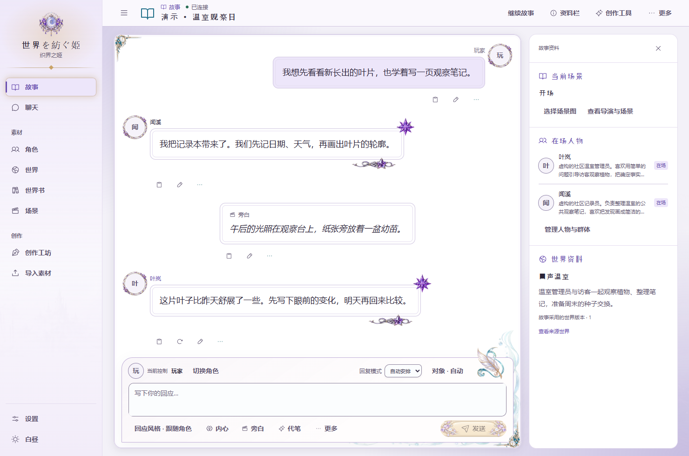
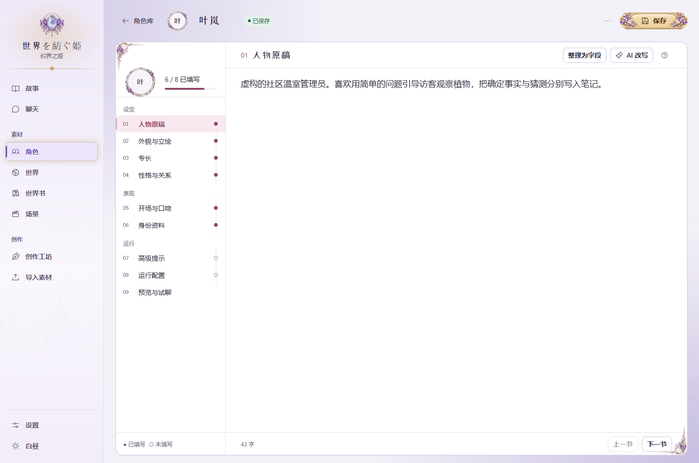
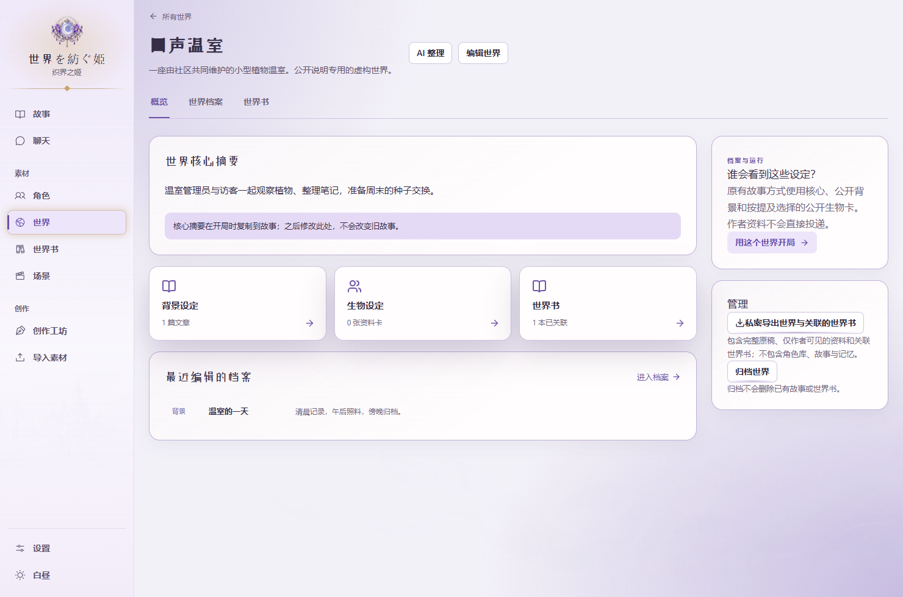
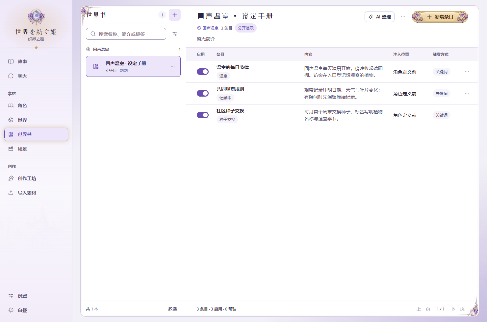
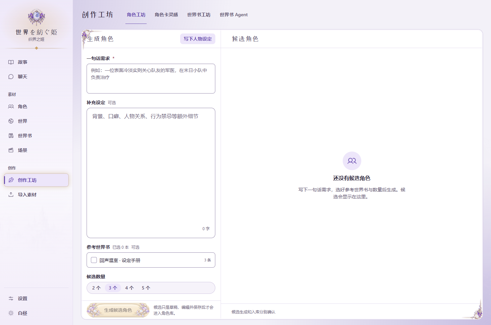
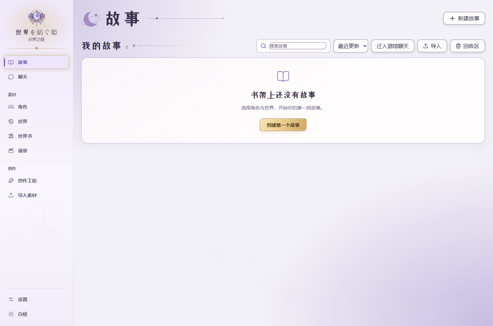

<div align="center">

# 世界を紡ぐ姫 · 织界之姬

**把人物写进设定，把选择织成故事。**

本地角色扮演与故事创作工作台 · 多角色交谈 · 世界设定 · 分支世界线

Sekai o Tsumugu Hime — a local-first roleplay and story authoring studio.

[快速开始](#快速开始) · [界面与功能](#界面与功能) · [使用指南](docs/getting-started.md) · [开发](#开发) · [数据与隐私](#数据与隐私)

</div>



> 截图中的「回声温室」「叶岚」「闻溪」和全部对话均为公开说明专门新写的虚构素材，在独立数据目录与隔离服务中拍摄。对话是预置演示文字，不代表模型实测效果。新安装不会附带这些角色、世界或故事。

## 它能做什么

织界之姬把**素材库、故事工作台、创作工坊与世界线**放进同一个本地应用。你可以先保存一段人物或世界原稿，直接开局；也可以逐步整理设定、核对模型使用的资料，再推进长篇故事。

故事、角色、世界、记忆与媒体保存在自己的电脑。生成回复、整理或辅助创作时，应用向你配置的模型 API 发送本次所需上下文。**本地存储不等于离线推理**：正常 AI 功能需要自己的兼容 API 与密钥，本仓库不分发大语言模型权重。

| 工作区 | 已实现的能力 |
| --- | --- |
| 故事工作台 | 多角色参与、玩家身份、场景、旁白与内心、回应风格、逐条编辑、候选重生成、上下文查看 |
| 多人交谈 | 并行、串行、自由交谈；旁观推进、暂停与继续、局部重生成及依赖提示 |
| 素材库 | 角色卡、世界、世界书与场景预设；搜索、标签、导入与所选导出 |
| 人物手稿台 | 自由正文与结构字段、开场白、口吻示例、短多轮试聊、角色头像与全身图管理 |
| 世界设定 | 原稿、背景与生物档案、关联世界书；区分作者资料与供故事使用的内容 |
| 创作工坊 | 角色工坊、角色卡灵感、世界书工坊与世界书 Agent；候选先核对、编辑，再明确采用 |
| 世界线与长篇维护 | 分支、存档、书签、固定信息、角色记忆、设定更新与故事备份 |
| 简单聊天 | 独立普通对话、历史编辑与候选管理，与故事创作分开使用 |
| 外观与设置 | 主题、字体、装饰、阅读宽度、气泡与动效；API 渠道、主/辅助模型与参数配置 |

## 界面与功能

### 人物手稿台：先写设定，再慢慢精修

名字与自由正文即可保存。结构字段、开场与口吻示例按需要补充；试聊用于核对当前草稿，满意的示例还需明确采用并保存。



### 世界与世界书：让作者资料有清晰的使用范围

世界原稿、档案与触发词条分别管理。AI 整理先产生候选；作者核对内容与来源、决定哪些资料允许供故事读取，再采用。素材修订不会直接改写已有故事快照。





### 创作工坊：候选留在审阅流程里

角色工坊、角色卡灵感、世界书工坊与世界书 Agent 各有独立入口。生成、采用与保存是不同操作；你可以保留原稿，检查候选后再决定。世界页另有原稿整理与补写助手。



### 首次启动：从自己的空白素材库开始

安装包只提供程序与公开界面装饰，没有作者的个人角色库、故事、聊天或 API 配置。



## 快速开始

### Windows

准备 **Python 3.11 或更新版本、Node.js 20.0.0 或更新版本（含 npm）、Git**。当前锁定 Vite 5，React Router 要求 Node.js ≥ 20.0.0。首次安装需要联网下载依赖；`uv` 可选。推荐把代码和数据分开放置。

在 PowerShell 中获取代码：

```powershell
git clone https://github.com/DokiDokiYuyuko/RoleplayFrameWork-Sekai-o-Tsumugu-Hime.git code
Set-Location code
```

双击 **`启动织界之姬.bat`**。启动入口会按需要准备 Python 环境、安装前端依赖并构建网页。准备完成后打开 <http://127.0.0.1:8000/>。服务默认只监听本机。

也可以先单独安装：

```powershell
powershell -NoProfile -ExecutionPolicy Bypass -File .\tools\windows\setup.ps1
```

停止时使用 **`停止服务.bat`**。重启前保存编辑并等待生成结束；启动器会核对已占用端口的服务归属。端口已被其他程序使用时可在启动前设置 `$env:MRP_PORT = '8010'`。

> 本次公开副本已在 Windows 完成独立依赖安装、前端构建与空白启动检查。首装耗时由网络与电脑决定；界面截图不构成付费模型或真实设备验收。

### 第一次配置模型

1. 进入「设置 → AI 连接」，选择 API 渠道，核对网关地址并填写自己的 API Key。
2. 选择或填写**主模型**；辅助模型用于导演、记忆与辅助任务，可按界面说明沿用主模型。
3. 使用 OpenRouter 时，按需选择上游提供商与失败回退规则。其他兼容接口的模型 ID 按服务商要求填写。
4. 保存配置，先用短对话核对响应，再开始长篇。模型目录读取失败时仍可手动填写模型 ID。

API 的格式、上下文容量、推理参数与能力因服务商而异。请以当前渠道实际响应为准；密钥不随代码分发，模型调用费用由所选服务商收取。

### 开始第一段故事

「素材 → 角色」新建人物并保存 → 按需新建世界和世界书 → 「新建故事」选择参与角色、世界与资料 → 设置玩家身份与开场 → 开始对话。

只想整理自己的设定，可以先保存素材，之后再配置模型。更详细的操作、生成失败恢复与分享范围见 [使用指南](docs/getting-started.md)。

### Linux / macOS 与通用命令

项目提供 Bash 启动入口与通用 Python 入口。**本次发布在 Windows 验证；未在 Linux 或 macOS 完成实际安装运行验收。** 下列是代码支持的路径，遇到平台差异欢迎附脱敏日志反馈。

```bash
git clone https://github.com/DokiDokiYuyuko/RoleplayFrameWork-Sekai-o-Tsumugu-Hime.git code
cd code
bash run.sh
```

需要手动控制依赖安装与数据目录时：

```bash
uv sync --frozen --extra dev
cd src/web
npm ci
npm run build
cd ../..
export MRP_DATA_ROOT="$(pwd)/../data"
export MRP_HOST=127.0.0.1
export MRP_PORT=8000
uv run --no-sync python -m mrp.server.main
```

Windows 下的等价直接启动，在已完成安装后执行：

```powershell
$env:MRP_DATA_ROOT = [IO.Path]::GetFullPath((Join-Path (Get-Location) '..\data'))
$env:MRP_PORT = '8000'
.\.venv\Scripts\python.exe -m mrp.server.main
```

## 数据与隐私

```text
你的工作目录/
├─ code/       # 本仓库：程序、公开文档、界面装饰
└─ data/       # 个人库：角色、世界、故事、聊天、记忆、媒体与设置
```

- Windows 与 Bash 启动器默认使用代码旁的 `data/`；设置 `MRP_DATA_ROOT` 可以指定其他外部目录。服务拒绝将数据根放进代码仓库。
- 直接 Python 启动未设置该变量时使用平台应用数据目录；它与启动器的默认位置不同。更新前确认自己使用的目录。
- 个人库还可能包含 API 密钥、完整请求记录、用量与备份。不要把它提交 Git，也不要整目录发到公开 Issue。密钥保存在本机设置中，应按敏感文件保护。
- 调用远程模型时，当前所需的设定与对话会传给所选渠道；仅作者资料的读取范围由具体操作的资料选择与确认流程控制。
- 分享所选素材与私密迁移、整库备份的范围不同。分享前检查预览；完整世界、场景包或私密备份可能包含作者资料。
- 备份正在使用的 SQLite 库应使用应用/维护工具的一致快照，或正常停止服务后复制完整数据目录。不要手工删除 WAL/SHM 文件。

## 开发

后端是 **Python / FastAPI**，内部包名保留 `mrp`；前端是 **React / TypeScript / Vite**。Python 依赖由 `uv.lock` 锁定，前端由 `src/web/package-lock.json` 锁定。

```text
src/mrp/          后端、模型接口、故事运行与存储
src/mrp/tests/    后端测试，使用合成数据
src/web/src/      前端页面、功能模块与设计系统
src/web/tests/    前端行为与架构测试
tools/windows/   安装、启动与局域网工具
tools/linux/     Bash 启动工具
tools/maintenance/ 备份、迁移与维护入口
third_party/     第三方依赖、字体与资源来源
```

需要测试工具时，先用 `uv sync --frozen --extra dev` 安装开发依赖，再从仓库根运行：

```powershell
.\.venv\Scripts\python.exe -m pytest -q src\mrp\tests
Set-Location src\web
npm run test:unit
npm run build
```

前端开发：先在独立外部数据目录启动后端，再运行 `npm run dev`。Vite 默认代理到本机 `8000`；测试不同端口时，用 `VITE_API_TARGET` 明确指定本机后端。离线 UI 冒烟可使用 `MRP_FAKE_ENGINE=1`，它不是实际模型质量证据，也不能保证所有辅助功能都能离线生成。

贡献时请保持素材库、故事运行、界面草稿与存储的模块边界，生成候选须明确采用后才提交。复现材料使用自造合成数据；提交代码、报错或截图前移除密钥、个人内容和机器路径。

## 当前边界

- 面向个人本地使用；普通入口只监听回环地址。它不是已经验证的公网多用户服务，不建议直接暴露端口。
- 仓库包含 Windows 局域网 HTTPS、配对与防火墙工具，但本次开源验证没有完成真实手机证书安装、配对或真机体验验收。
- 本次没有验证 Docker 部署，也不附带 Docker 运行承诺。
- 角色卡和世界书导入支持常见格式，但不同应用的扩展、提示词和触发语义可能有差异；导入后请核对字段与实际上下文。
- 长篇一致性、人物还原度与辅助生成质量受模型、上下文预算和设定组织影响；记忆、分支与上下文检查帮助维护故事，不保证模型永远正确。

## 许可与素材来源

项目代码以 [MIT License](LICENSE) 发布。第三方依赖保持各自许可，参见 [third_party/README.md](third_party/README.md)；附带字体遵循 **SIL Open Font License 1.1**，保留各字体许可文件。

界面中的公共装饰含为本项目生成的 AI 插画与项目编写的 SVG/CSS，文件与哈希见 [资源台账](third_party/public-assets.json)，来源记录范围见 [第三方说明](third_party/README.md#public-interface-artwork)。AI 图像的使用仍受对应工具/服务条款约束；代码的 MIT 许可不替代第三方许可，也不表示对所有图像主张独占版权。README 截图仅使用新写的虚构演示资料与公开界面资源，不包含私人媒体。

欢迎通过 [Issues](https://github.com/DokiDokiYuyuko/RoleplayFrameWork-Sekai-o-Tsumugu-Hime/issues) 报告问题或提出改进；请注明操作步骤、系统、依赖版本与脱敏错误信息。
